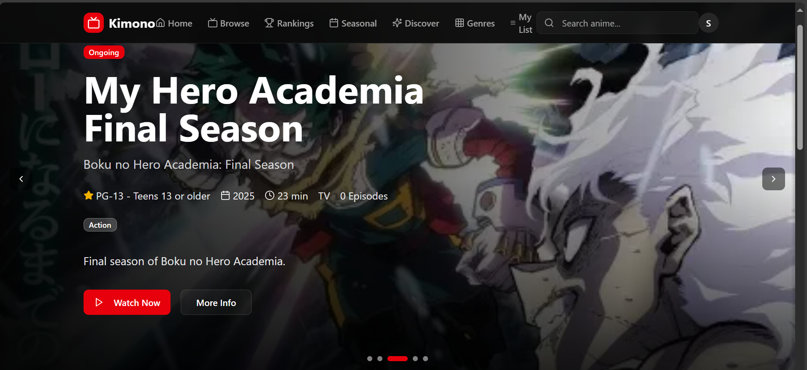
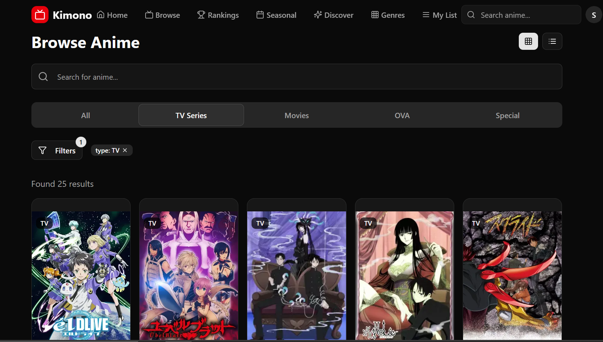
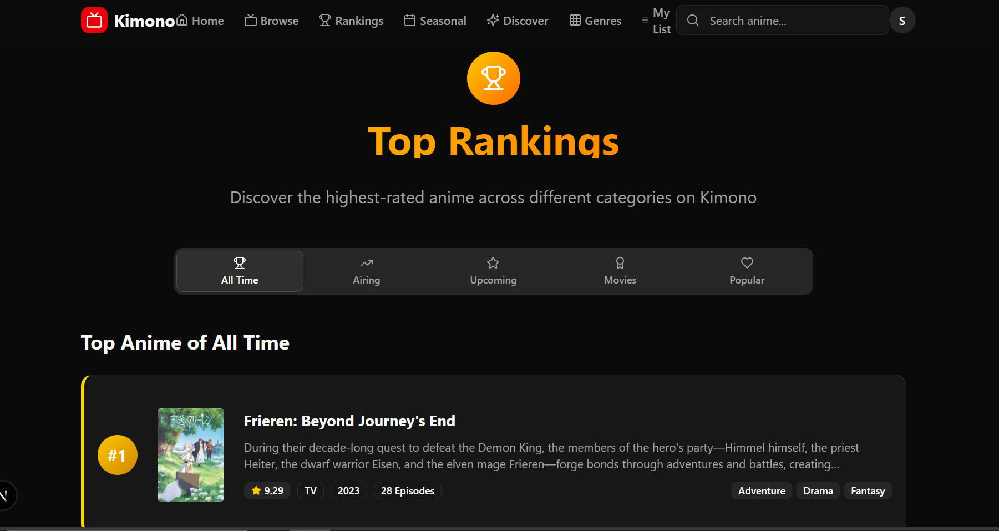
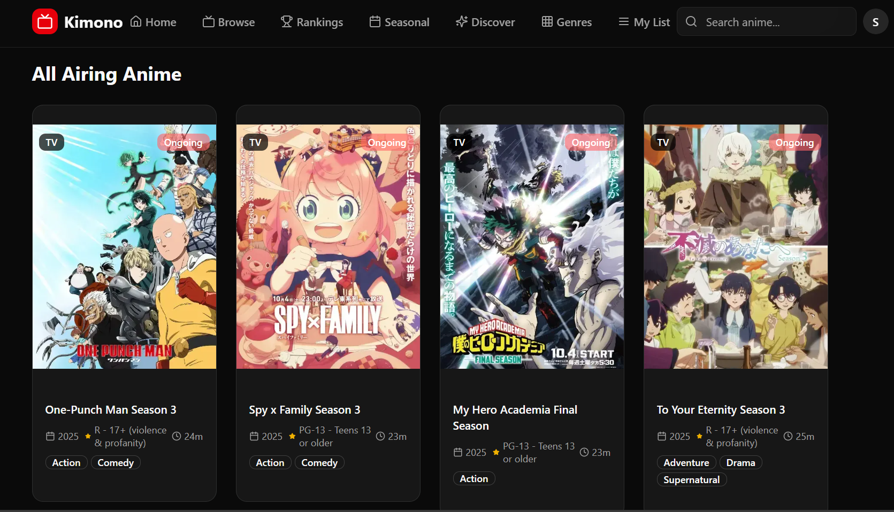
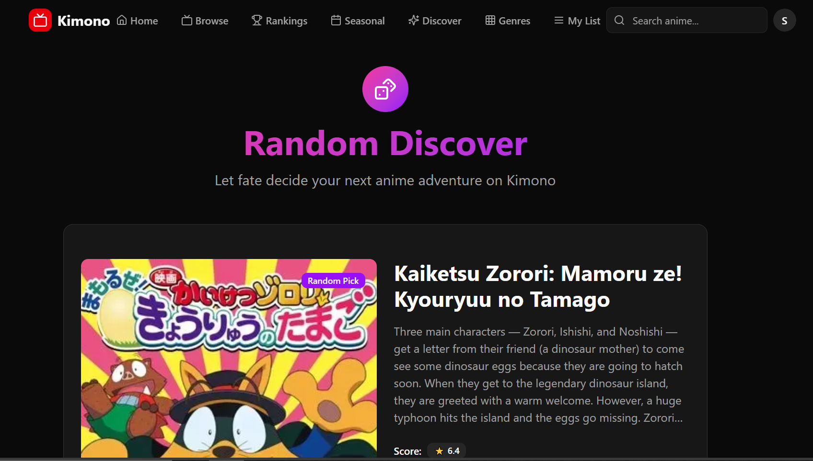
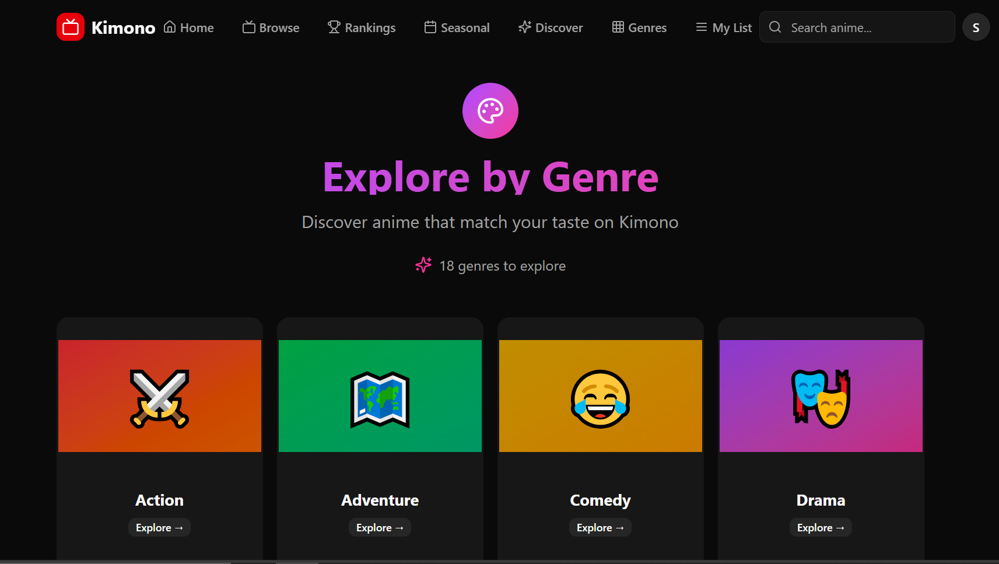
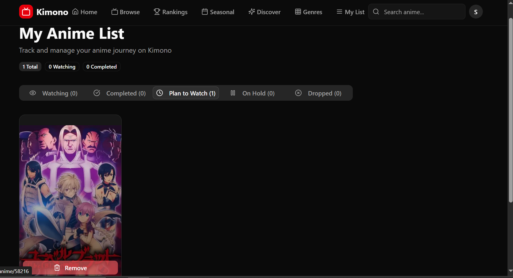
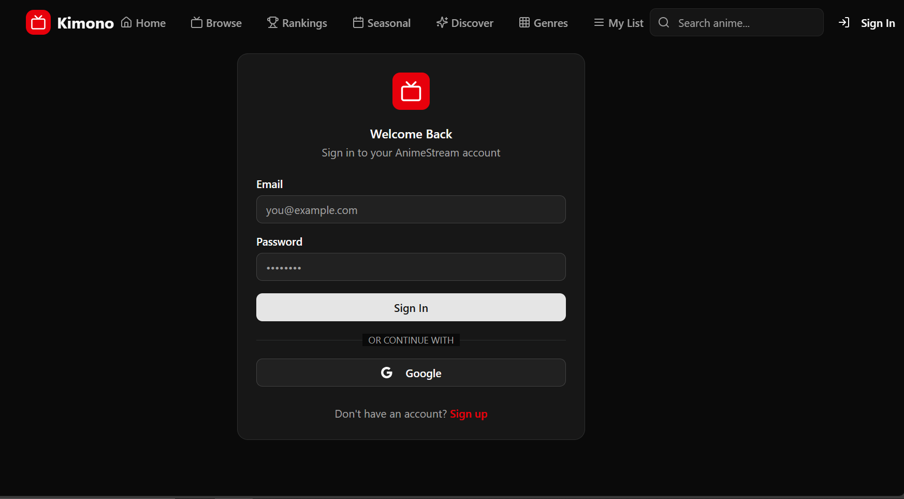

# 🎬 Kimono - Your Ultimate Anime Streaming Platform

A modern, feature-rich anime streaming and discovery platform built with Next.js 15, featuring real-time data from MyAnimeList via Jikan API, user authentication, and personalized anime lists.

## ✨ Technology Stack

This scaffold provides a robust foundation built with:

### 🎯 Core Framework
- **⚡ Next.js 15** - The React framework for production with App Router
- **📘 TypeScript 5** - Type-safe JavaScript for better developer experience
- **🎨 Tailwind CSS 4** - Utility-first CSS framework for rapid UI development

### 🧩 UI Components & Styling
- **🧩 shadcn/ui** - High-quality, accessible components built on Radix UI
- **🎯 Lucide React** - Beautiful & consistent icon library
- **🌈 Framer Motion** - Production-ready motion library for React
- **🎨 Next Themes** - Perfect dark mode in 2 lines of code

### 📋 Forms & Validation
- **🎣 React Hook Form** - Performant forms with easy validation
- **✅ Zod** - TypeScript-first schema validation

### 🔄 State Management & Data Fetching
- **🐻 Zustand** - Simple, scalable state management
- **🔄 TanStack Query** - Powerful data synchronization for React
- **🌐 Axios** - Promise-based HTTP client

### 🗄️ Database & Backend
- **🗄️ Prisma** - Next-generation Node.js and TypeScript ORM
- **🔐 NextAuth.js** - Complete open-source authentication solution

### 🎨 Advanced UI Features
- **📊 TanStack Table** - Headless UI for building tables and datagrids
- **🖱️ DND Kit** - Modern drag and drop toolkit for React
- **📊 Recharts** - Redefined chart library built with React and D3
- **🖼️ Sharp** - High performance image processing

### 🌍 Internationalization & Utilities
- **🌍 Next Intl** - Internationalization library for Next.js
- **📅 Date-fns** - Modern JavaScript date utility library

## 📸 Screenshots

<div align="center">
  <h3>🎬 Kimono - Your Ultimate Anime Platform</h3>
</div>

<table>
  <tr>
    <td width="50%">
      
      <p align="center"><strong>🎯 Home Page</strong><br/>Beautiful landing page with trending anime</p>
    </td>
    <td width="50%">
      
      <p align="center"><strong>🔍 Browse Page</strong><br/>Advanced search and filtering system</p>
    </td>
  </tr>
  <tr>
    <td width="50%">
      
      <p align="center"><strong>🏆 Rankings</strong><br/>Top-rated anime across all categories</p>
    </td>
    <td width="50%">
      
      <p align="center"><strong>📅 Seasonal</strong><br/>Current season anime releases</p>
    </td>
  </tr>
  <tr>
    <td width="50%">
      
      <p align="center"><strong>✨ Discover</strong><br/>Random anime recommendations</p>
    </td>
    <td width="50%">
      
      <p align="center"><strong>🎨 Genres</strong><br/>Browse by anime categories</p>
    </td>
  </tr>
  <tr>
    <td width="50%">
      
      <p align="center"><strong>📝 My List</strong><br/>Personal anime collection</p>
    </td>
    <td width="50%">
      
      <p align="center"><strong>🔐 Authentication</strong><br/>Secure sign in/up system</p>
    </td>
  </tr>
</table>

<div align="center">
  <p><em>✨ Explore all the amazing features of Kimono anime platform</em></p>
</div>

---

## 🎯 Development

This project is built with modern web technologies and follows best practices for:

- **💻 Component Architecture** - Modular and reusable components
- **🎨 UI Development** - Beautiful and responsive interfaces
- **🔧 Type Safety** - Full TypeScript support with strict type checking
- **📝 Code Quality** - ESLint configuration and best practices
- **🚀 Performance** - Optimized builds and lazy loading
- **🔐 Auth Included** - NextAuth.js for secure authentication flows
- **📊 Data Visualization** - Charts, tables, and drag-and-drop functionality
- **🌍 i18n Ready** - Multi-language support with Next Intl
- **🚀 Production Ready** - Optimized build and deployment settings
- **📖 Well-Structured** - Clean and maintainable codebase architecture

## 🚀 Quick Start

```bash
# Install dependencies
npm install

# Set up environment variables (optional, for authentication)
# Copy env.example.txt to .env.local and add your Supabase credentials

# Start development server
npm run dev

# Build for production
npm run build

# Start production server
npm start
```

Open [http://localhost:3000](http://localhost:3000) to see your application running.

> **📖 For detailed setup instructions, see [SETUP.md](./SETUP.md)**

## 📁 Project Structure

```
src/
├── app/                 # Next.js App Router pages
├── components/          # Reusable React components
│   └── ui/             # shadcn/ui components
├── hooks/              # Custom React hooks
└── lib/                # Utility functions and configurations
```

## 🎨 Available Features & Components

This scaffold includes a comprehensive set of modern web development tools:

### 🧩 UI Components (shadcn/ui)
- **Layout**: Card, Separator, Aspect Ratio, Resizable Panels
- **Forms**: Input, Textarea, Select, Checkbox, Radio Group, Switch
- **Feedback**: Alert, Toast (Sonner), Progress, Skeleton
- **Navigation**: Breadcrumb, Menubar, Navigation Menu, Pagination
- **Overlay**: Dialog, Sheet, Popover, Tooltip, Hover Card
- **Data Display**: Badge, Avatar, Calendar

### 📊 Advanced Data Features
- **Tables**: Powerful data tables with sorting, filtering, pagination (TanStack Table)
- **Charts**: Beautiful visualizations with Recharts
- **Forms**: Type-safe forms with React Hook Form + Zod validation

### 🎨 Interactive Features
- **Animations**: Smooth micro-interactions with Framer Motion
- **Drag & Drop**: Modern drag-and-drop functionality with DND Kit
- **Theme Switching**: Built-in dark/light mode support

### 🔐 Backend Integration
- **Authentication**: Ready-to-use auth flows with NextAuth.js
- **Database**: Type-safe database operations with Prisma
- **API Client**: HTTP requests with Axios + TanStack Query
- **State Management**: Simple and scalable with Zustand

### 🌍 Production Features
- **Internationalization**: Multi-language support with Next Intl
- **Image Optimization**: Automatic image processing with Sharp
- **Type Safety**: End-to-end TypeScript with Zod validation
- **Essential Hooks**: 100+ useful React hooks with ReactUse for common patterns

## 🤝 Get Started

1. **Install dependencies**: `npm install`
2. **Set up your environment**: Create a `.env` file with necessary variables
3. **Start development**: `npm run dev`
4. **Build for production**: `npm run build`
5. **Deploy with confidence** using the production-ready setup

---

Built with ❤️ for modern web development 🚀
